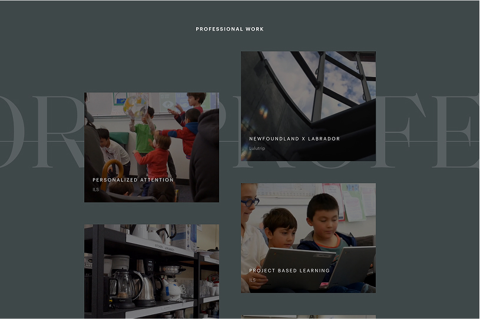
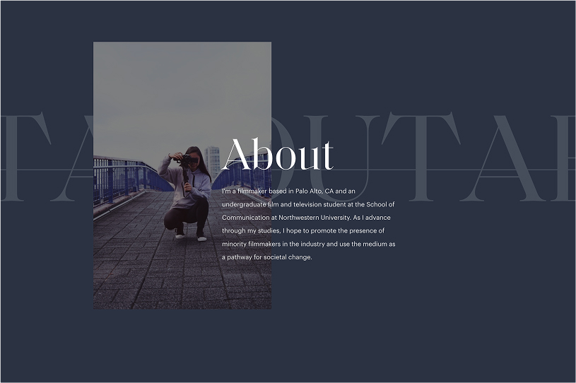
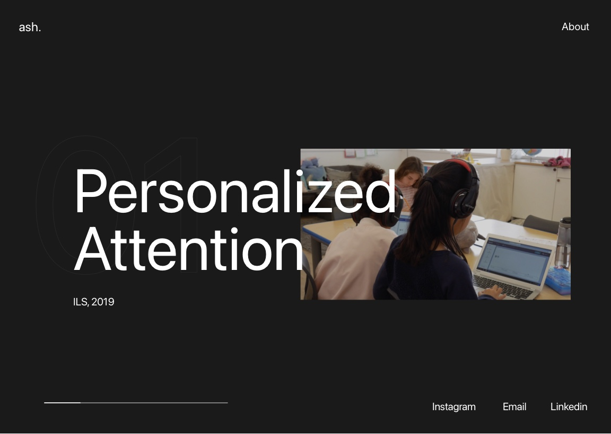
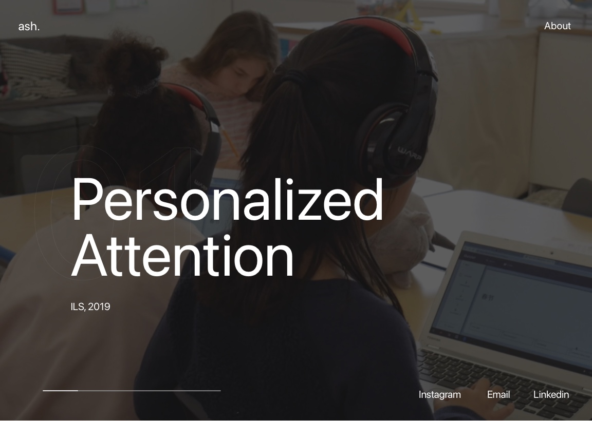
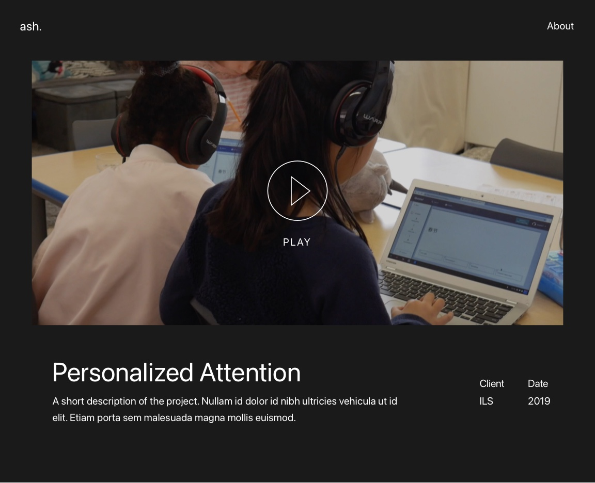
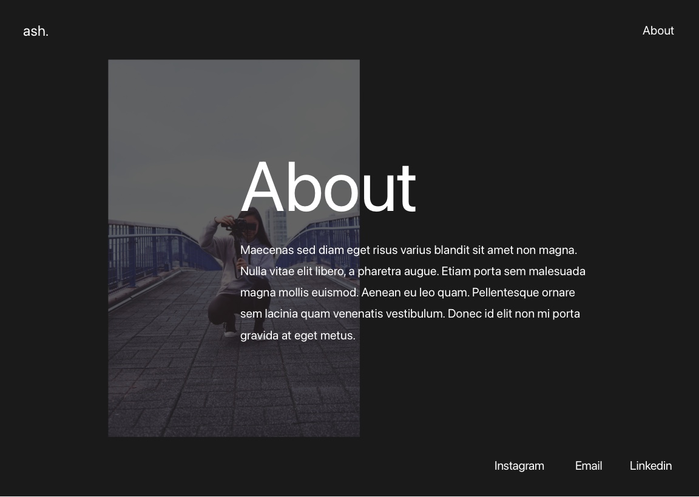
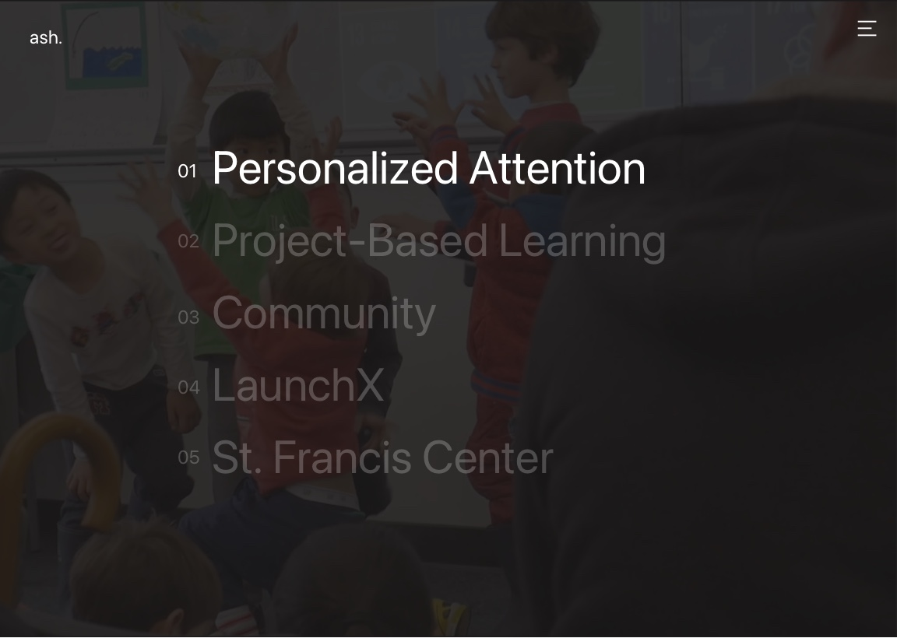

    
I designed and developed a website for a short-film videographer. My client was an up-and-coming filmmaker and wanted to emphasize a professional quality to her work.

    

        
    

    

        
    

## Initial Concepts

    

        
    

    

        
    

    

        
    

    

        
    

    

        
    

