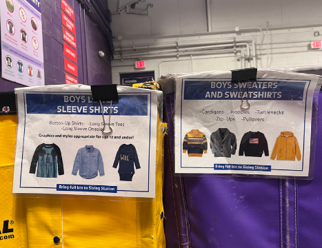
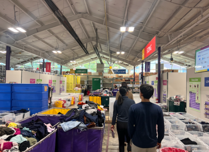
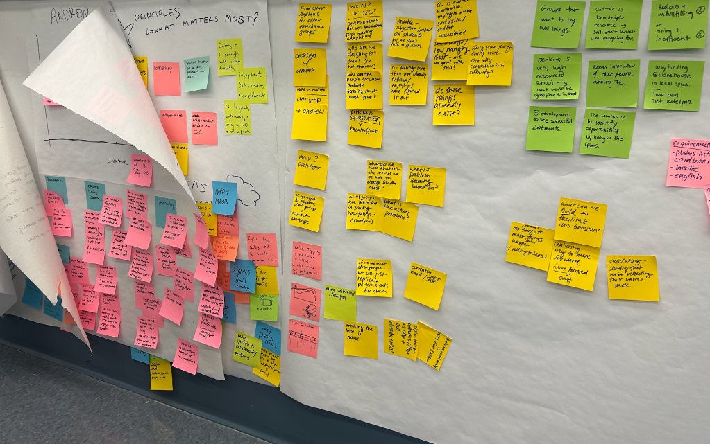
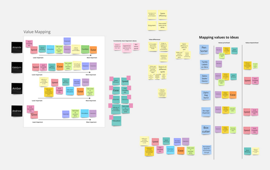
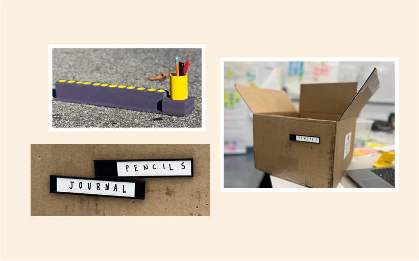

### About Cradles to Crayons
For my Technology, Accessibility, and Design class, we partnered with Cradles to Crayons, a clothing-sorting nonprofit in the Greater Boston area that provides children and families with clothing, hygiene, and school supplies.

Cradles to Crayons runs a large volunteer program to sort clothing and other supply donations, and maintains an enrichment program for schools that teach people with disabilities to volunteer.

## 1. Problem Framework
volunteers primarily sort clothing, school supplies, and hygiene kits, but there was a question of accessibility and independence. How could tasks be made more fulfilling, less overwhelming, and better suited to varying abilities? We aimed to build tools or resources that would help them volunteer more independently and confidently.

## 2. Initial Visit
During our first visit to C2C, we observed volunteers from Perkins School, a group well-resourced and equipped to handle specific accommodations. We quickly realized that they had already made adaptations for their volunteers.

Since our initial framework seemed less relevant for this group, we changed our focus to other groups where our efforts would be more important.

    

        
    

    

        
    

## 3. Co-Designs and Ideation
Our team worked closely with various stakeholders, including C2C staff, volunteer managers, and teachers from .

Through interviews and value mapping, we identified a common set of values shared by the group, such as promoting volunteer independence, and ensuring the tasks were not about speed, but about personal fulfillment. However, there was disagreement on how easy tasks should be and how far we should go in accommodating volunteers. Despite these differing perspectives, we aligned on key values that guided our design process. The result was a series of ideas for tools, ranging from physical modifications to process improvements, aimed at fostering a more inclusive environment.

    

        
    

    

        
    

## 4. Reorienting and Adjusting Perspective
After talking with our stakeholders, we realized from the C2C team's perspective, our investigative process felt overly detailed and long without producing concrete outcomes. We recognized that our approach may have come off as overly inquisitive without delivering tangible products, so we recalibrated and began focusing on a more immediate, practical solution that could be implemented right away.

## 5. Downscoping the Project
After reorienting, we returned to Cradles to Crayons and brought with us prototypes that aimed to directly address the needs identified. We tested out our prototypes with volunteers, and learned that the pen sorters should have braille numbers 

## 6. Final Deliverables

### Tactile Braille Labels
- 3D printed holders
- Pins that insert into cardboard, and can be easily removed and set into another box
- Easy insertion and removal of paper labels
- Text in print for non-Braille readers

### Pen Sorters
- High-contrast colors with C2C branding
- 12 holes for pens, added as a tactile guide for visually impaired volunteers to more easily count
- Braille and large-print numbers to ensure accessibility for a broader range of users
- Pen holder to more easily tie rubber bands for volunteers with fine motor skills issues

## 7. Key Takeaways

- **Establish trust early**: The collaborative design process worked better when we fostered trust and communication from the start.
- **Deliver physical solutions first**: We realized that stakeholders were more receptive to tangible prototypes, while deeper process-oriented discussions could follow.
- **Manage expectations**: Setting clear expectations for the process upfront would have helped reduce any misunderstandings about the scope and pace of the project.

