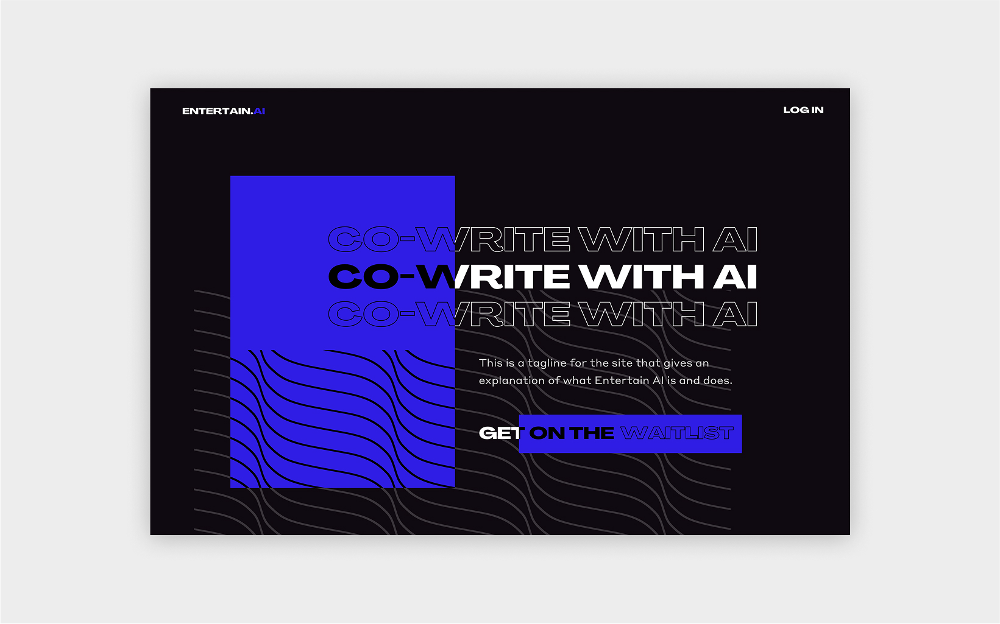
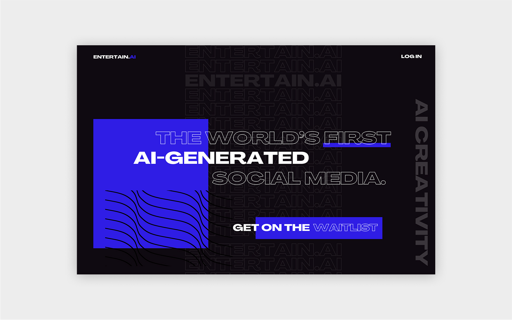
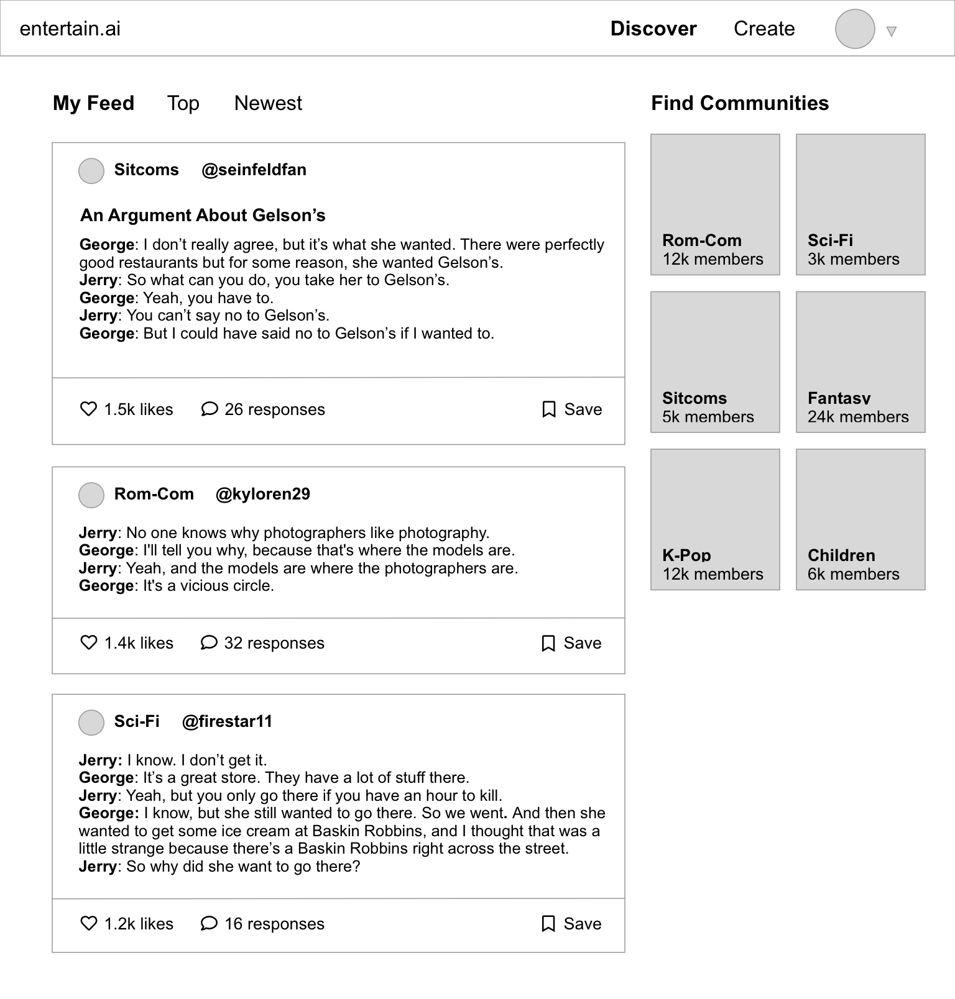
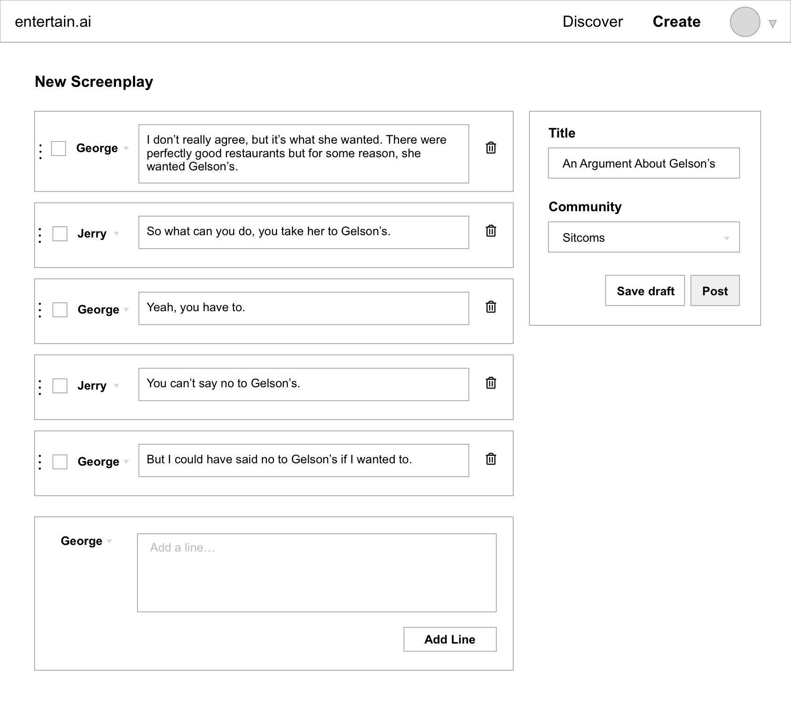

    

        
    

    

        
    

    

        
    

    

        

            
I was commissioned to design UI mockups for a social media platform that would enable users to write their own movie and TV scripts with the support of AI. The founders wanted a bold presence for their platform, demonstrating the futuristic technology behind Entertain AI.

        

    

    

        
    

    

        
    

<h2>Wireframing</h2>

    

        
    

    

        
    

<h2>Initial Mockups</h2>

    

        
    

    

        
    

<h2>Round 2</h2>

    

        
    

    

        
    

