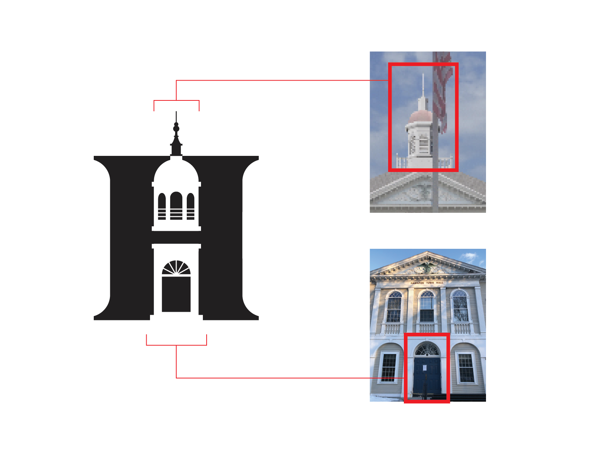
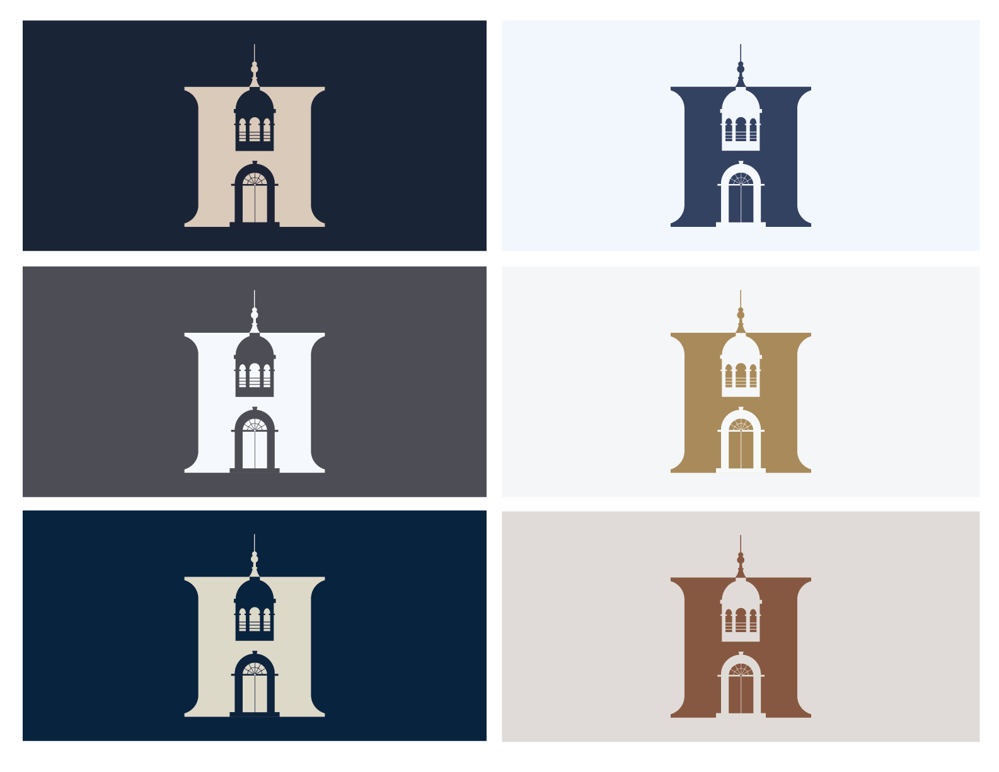
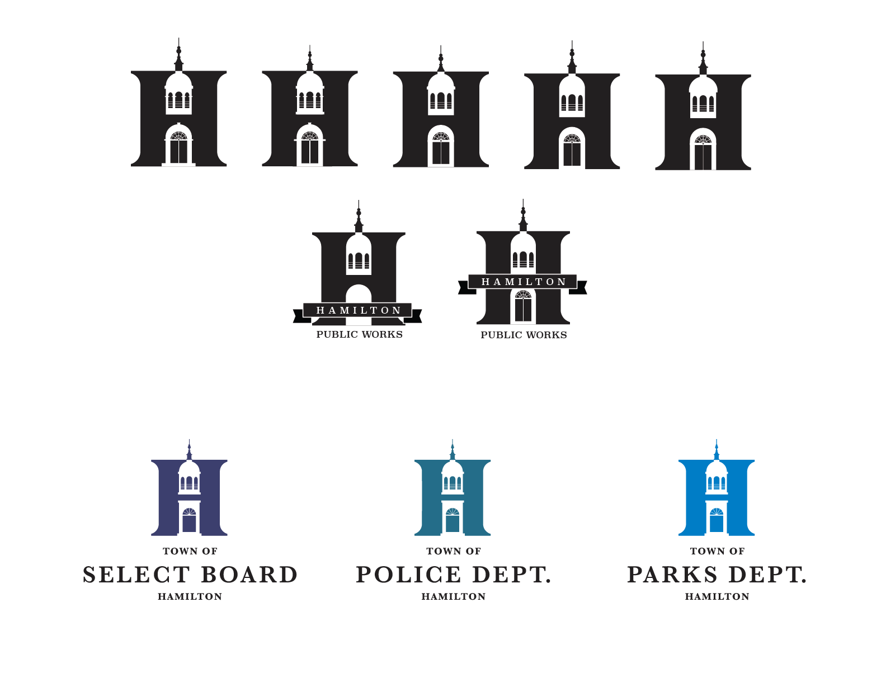
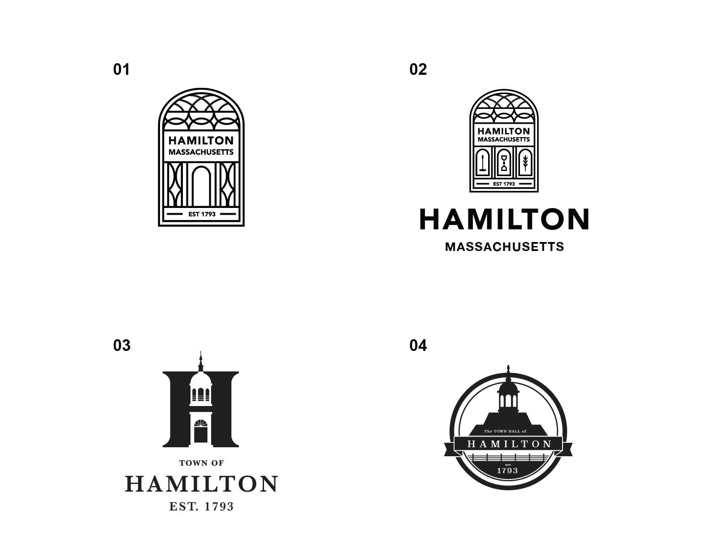
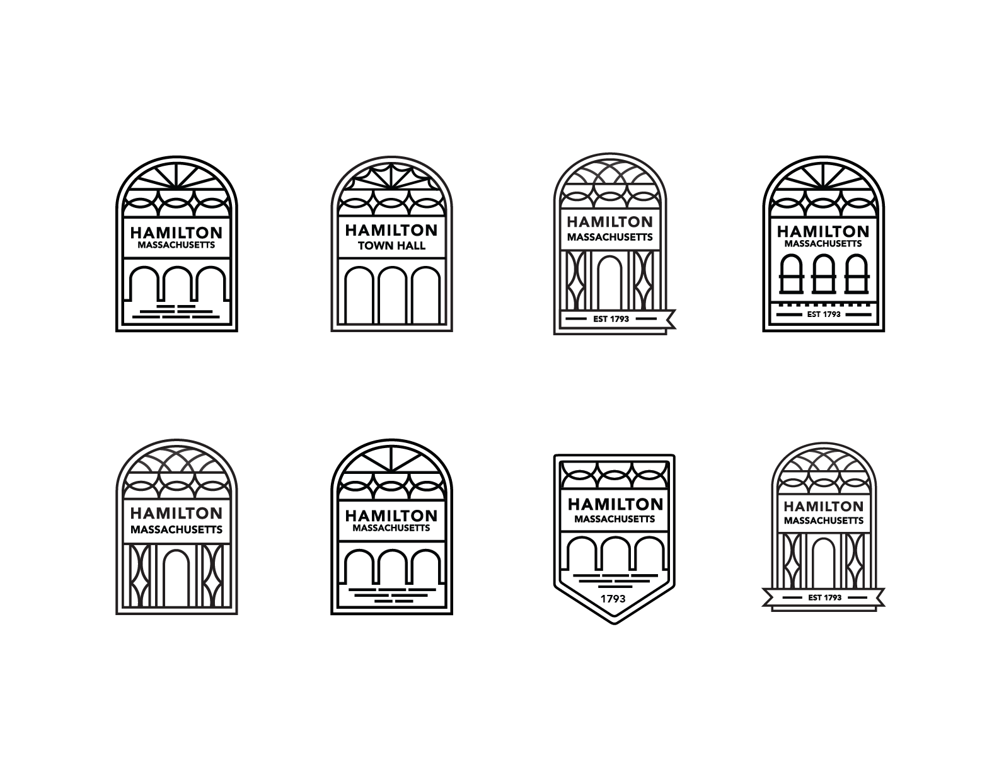

I designed these logos alongside [Tim Sauder](https://www.asmallpercent.com/) through the Return Design Studio. His friend in City Hall in Hamilton had asked for a set of logo options to rebrand the Town Hall.

 
    

        
    

    

        
    

## Alternate Variations

