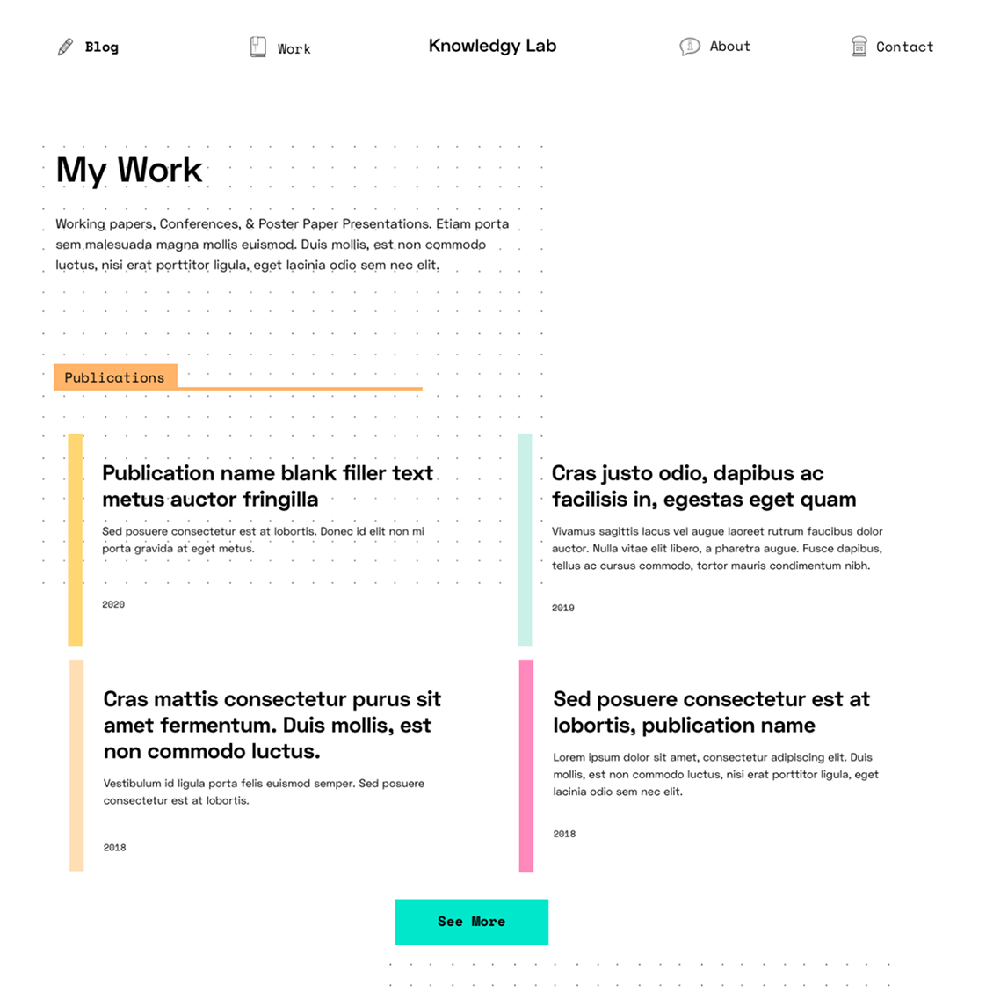

    

        
    

    

        

            
I was commissioned to design and develop an online presence for a post-doc early-childhood education researcher. She wanted a bright, playful design to reflect the content of her work as someone who works frequently with kids.

        

    

    

        
    

    

        
    

## Early Rounds

In the early rounds of the design, I presented options that ranged from more professional to more playful, emphasizing bright colors and expertise.

    

        
    

    

        
    

    

