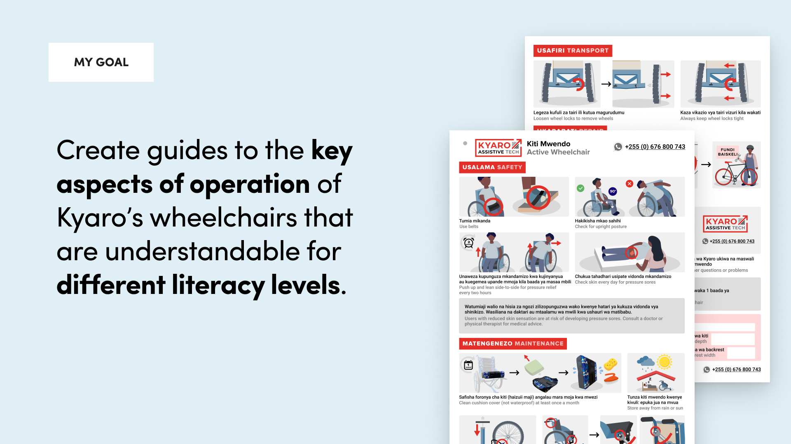

## The Problem

Kyaro is an assistive tech organization based in Arusha, Tanzania, making custom-fitted wheelchairs and other assistive devices using locally available parts. I lived and worked in Arusha as a design intern in summer 2023.

**Problem Framework:** When wheelchairs break down, users tend to abandon them instead of doing repairs. They also sometimes use the wheelchairs in unsafe ways.

**My Goal:** Create guides to the key aspects of operation of Kyaro’s wheelchairs that are understandable for different literacy levels.

This guide also serves as powerful asset in securing grants for Kyaro by showcasing their commitment to product quality and user care.

<!--  -->

## User Research

#### Research & Landscape Review:

I began by reviewing a variety of wheelchair manuals, some written in Swahili and others from international contexts. Most manuals were dense, legalistic, and with long paragraphs and excessive legal warnings.

I looked for examples of successful instructional design and found inspiration in airplane safety cards. These cards were highly effective because they condensed a large amount of information into a small space using diagrams and minimal text. This approach would be key in ensuring the guides I designed would be universally accessible, regardless of literacy levels.

## Initial Stakeholder Engagement:

Hearing directly from Kyaro staff, physical therapists, and users.
* 3 Kyaro Staff
* 3 Physical Therapists
* 1 User Visit

I wanted to know the most critical maintenance and repair information, focusing on why users might neglect maintenance.

##### Sample Questions
* _Imagine you were delivering a wheelchair to me. What would you say to me when you delivered it?_
* _Do customers use wheelchairs in unsafe ways? Why?_
* _What stops users from repairing their chairs?_
* _If you follow up with a customer and if they’re not using it, why?_

#### Analyzing the Data:

I organized the insights from my interviews on a Miro board, identifying 24 key instructions that physical therapists often emphasize. From there, I categorized the instructions into four main areas: safety, usage, maintenance, and repair.

Stigma around disability came up over and over in my interviews, and helped clarify two key values for designing the manuals.

* **Value 1: Decrease Complexity:** Caretakers can be intimidated by the complexity of the device. We should emphasize that most repairs could be done locally, by bicycle fundi (repairmen) or seamstresses, and that caregivers already have all the resources they need to take care of the wheelchair.
* **Value 2: Prioritize Excitement, Community, and Play:** 
While PTs often saw people using the wheelchairs in technically unsafe ways -- for example, climbing over the wheelchairs, and pushing it super fast - my interviewees emphasized that they see this as a positive thing. This meant other children wanted to play - despite the stigma. We needed to prioritize excitement rather than overemphasizing safety warnings that could inadvertently reinforce stigma.

## Prototypes

I moved on to designing a low-fidelity prototype of the manual and sought feedback from caregivers and physical therapists. This process involved five rounds of revisions, with each iteration refining both the clarity of illustrations and the selection of content. 

## Final Product
I designed 2 manuals, for the main wheelchair product and for a tricycle attachment addition. I also created an style guide to inform future illustration work at Kyaro.

## What I Learned

Not only was this an opportunity to hone my design and visual communication skills, but I also gained valuable insight into the challenges of designing in unfamiliar cultural contexts. 

As an outsider designing for a community I wasn’t part of, I learned the importance of codesign and ensuring that my design choices were informed by local input.

**What I Would Do Differently:** I would have tested the assumption that providing more detailed repair information would increase the likelihood of repair. One way to do this could have been to follow up with caregivers a few months later to see if the manual influenced their behavior.

