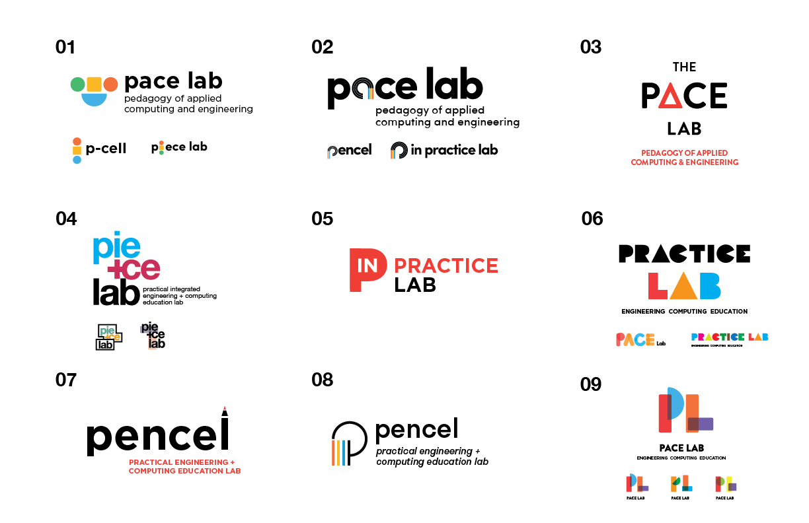

## Alternate Variations

I designed these logos alongside [Tim Sauder](https://www.asmallpercent.com/) through the Return Design Studio. Together, we iterated on names that would accurately convey the concept of hands-on engineering and computing pedagogy. We wanted to stick to bold, bright colors without being too "childish".

